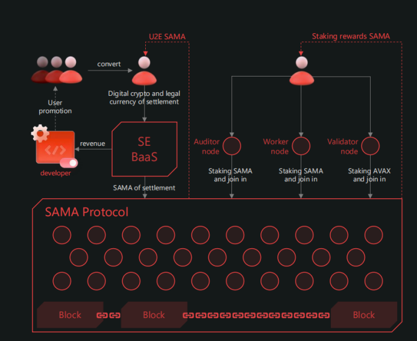

# 6 SAMA协议的激励机制
&emsp;&ensp;SAMA项目的代币简称SAMA，SAMA项目的40%代币激励分配给为社区贡献者，SAMA协议和基于SAMA协议的应用开发者以及基于中间件的应用开发者共同构建DAO，DAO组织定义这些用户的行为，这些行为将会在一定周期内作为对生态的贡献被给予奖励。40%的奖励分配创作者和创客们以及他们的用户，这个生态将自发的完善，自我裂变。 
在社区内发行的经济行为可以大致划分为以下几类： 
> * 验证节点质押AVAX代币和SAMA代币
> * 审计节点和工作节点质押SAMA代币
> * 创客用户们在DAO上定义的行为
> * 开发者基于SAMA协议SDK&API开发web3应用
> * 用户向应用产品付费
 

&emsp;&ensp;对于生态的开发者而言，开发的应用会得到相应的补贴。对于生态开发项目的使用者来说需要购买SAMA代币进行一定的支付费用。对于SAMA社区成员来说SAMA代币将会作为他们不断为社区贡献力量的奖励。对于想成为SAMA分片网络的审计员(Auditor node)和工作者(Worker node)的人来说SAMA代币将作为您注册成为分片网络节点的质押工具。并且SAMA代币也将用于奖励审计员为网络提供安全性和稳定性，也将奖励工作者(Worker node)为网络运行提供大量的服务。 

 

&emsp;&ensp;从上图中可以知道团队会提供一个中间件**[（SE BaaS）](1.md)**确保在SAMA网络上协同开发的开发者一起构建DAO来分配激励和定义用户行为。 
&emsp;&ensp;从上图中可以知道，想要成为SAMA网络验证者节点的人需要质押雪崩链的AVAX代币才能成为验证者节点（Validator node） 
